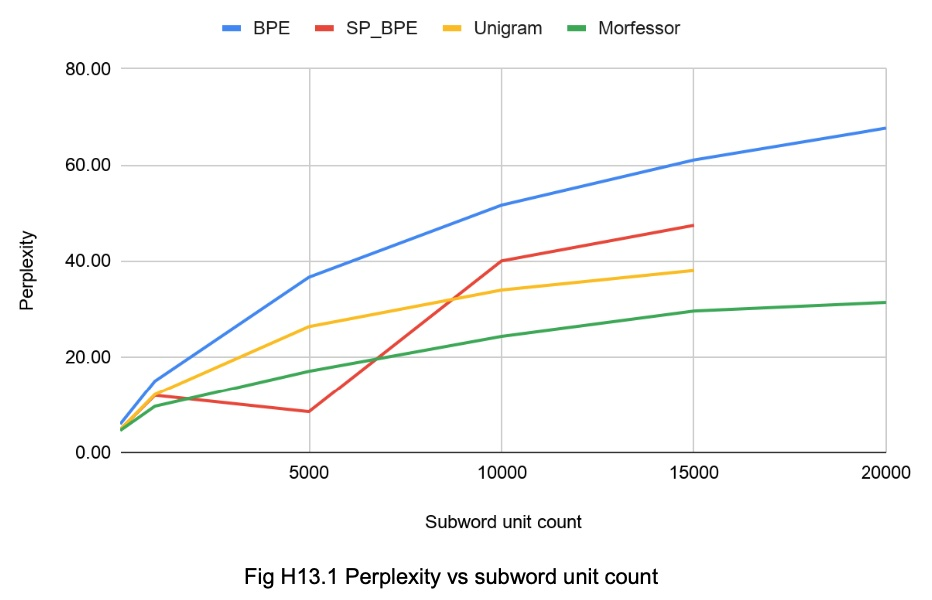

# Subword perplexity evaluation

This repository provides scripts for creating and evaluating several tokenization strategies for Icelandic.

## Overview

This project has been created by the [Language and Voice Lab](https://lvl.ru.is/) at Reykjavík University and is part of the [Icelandic Language Technology Programme](https://github.com/icelandic-lt/icelandic-lt).

- **Category:** [ASR](https://github.com/icelandic-lt/icelandic-lt/blob/main/doc/asr.md)
- **Domain:** Workstation / Server
- **Languages:** Python
- **Language Version/Dialect:**
  - Python: 3.7+
- **Audience**: Developers, Researchers
- **Origins:** [GitHub](https://github.com/Daviderikmollberg/subword_perplexity_tests)

## Status

This project lacks some information about the exact dataset preparation steps and therefore cannot be reproduced as-is. Additionally, the exact dependencies are unknown and therefore it might be difficult to reproduce with the current code. However, the scripts can be used as a starting point for similar experiments.

The findings are certainly useful for other LT areas, like e.g. foundation models, TTS, etc.

## Description

Icelandic is an inflective language and new words are constantly being created by compounding words together. Finding successful ways of handling both all the different grammatical surface forms of words, and the many compounds is crucial to reducing the rate of unknown words in Language technology tasks.
One common approach is breaking down whole words into smaller units (often called word pieces or subword units), which are then used to train a language model (LM). This process reduces the count of the tokens the LM has to model, thereby also minimizing the out-of-vocabulary rate and improves modelling of sparse words.

Subword units can range from a single character (corresponding to a single phoneme), to one or more syllables, and up to whole words. The principle of subword modeling is to split words into subword units of a varying length (one character or more). This process is also called a subword tokenization. The created tokens are then used to train a LM, instead of using the whole word as the base unit for modelling.

We have implemented two Byte Pair Encoding (BPE) algorithms, an algorithm commonly referred to as Unigram, and Morfessor.
The BPE algorithm is the simplest algorithm of the ones we tested. The algorithm counts the frequency of each word in the training corpus, represents the word as a sequence of graphemes, and adds an end-of-word symbol to each word. Then it counts all symbol pairs and replaces each occurrence of the most frequent symbol pair with a new symbol. This is done iteratively until a desired subword token count is reached.

In contrast to BPE, Unigram initializes its base tokens to a large number of symbols and progressively prunes it down to obtain a smaller count by choosing to remove the symbols that minimize the log-likelihood over the training data.

Morfessor is a family of probabilistic machine learning methods for finding the morphological tokenization of raw text data. Using a hyperparameter, `α` for the likelihood in the cost function, we can choose how aggressively the algorithm tokenizes the words. A low `α` increases the priors influence, favoring shorter subword units. A high `α` value increases the data likelihood influence, favoring longer subword units. This hyperparameter can be automatically tuned given a fixed subword unit count.

We modified a script that is available in the GALE-arabic recipe in the [Kaldi repository](https://github.com/kaldi-asr/kaldi/tree/master/egs/gale_arabic) for one of the BPE implementations and used [Google’s SentencePiece](https://github.com/google/sentencepiece) (SP) library for the other BPE implementation (SP_BPE) and the Unigram algorithm. We also used the package [Morfessor](https://github.com/aalto-speech/morfessor).

### Dataset
The corpus we used was the older version of the Icelandic Gigaword Corpus ([IGC](https://repository.clarin.is/repository/xmlui/handle/20.500.12537/192)) which is not available anymore by Clarin.is, but we needed to scale it down by 10% to get the SP models to work on our server due to memory constraints.

### Evaluation
The corpus was split into the train and test subset, using the 9:1 ratio, with a minimum sentence overlap. We used KenLM to create 6-gram LMs using the corpus that had been tokenized with each of the above methods. BPE and Unigram are dependent on a hyperparameter that controls the token count and finding the correct number of modelled subword units is an open question. Finally, we evaluated the created LMs in terms of their perplexity on the test subset of the text corpora in terms of the token count.

Fig. H13.1 plots the obtained perplexities (lower numbers are better) as a function of subword unit count:

### Conclusion
The SP_BPE and Unigram models behave almost identically. In this test, they both have zero out-of-vocabulary (OOV) errors. On the contrary, the BPE in GALE-arabic scripts consistently has around 5500 OOV errors. This most likely because both the SP_BPE and Unigram include the original language characters (the alphabet) in the list of subword units. This means that they can always construct all words in the test subset using those characters. That is also true for Morfessor.